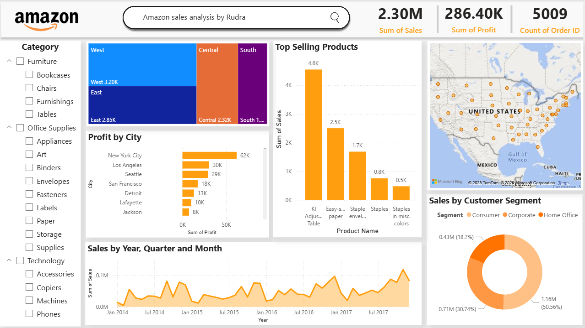

# 📊 Amazon Sales Analysis Dashboard

**Created by:** Rudra  
**Tool Used:** Power BI  
**Data Source:** Amazon Sales Dataset  

## 📸 Dashboard Preview

---

## 📌 Overview

This interactive Power BI dashboard provides a comprehensive analysis of Amazon sales performance across different categories, regions, cities, time periods, and customer segments. The dashboard is designed to help stakeholders quickly gain insights into business performance and make data-driven decisions.

---

## 📈 Key Metrics

- **Total Sales:** 2.30M  
- **Total Profit:** 286.40K  
- **Total Orders:** 5009  

---

## 🔍 Dashboard Features

### 1. **Sales by Region**
- A tree map displays sales volume across four major regions: **West, East, Central, South**.
- West region leads with **3.20K** in sales.

### 2. **Top Selling Products**
- Highlights top 5 products by total sales.
- Example: *KI Adjustable Table* tops with **4.6K** sales.

### 3. **Profit by City**
- Bar chart showing profits from top-performing cities.
- **New York City** leads with **62K** profit.

### 4. **Sales Trend**
- Line chart tracks monthly sales trends from **2014 to 2017**.
- Highlights seasonal spikes and business growth.

### 5. **Geographic Distribution**
- A map of the USA showing locations of orders and distribution of customers.

### 6. **Customer Segment Breakdown**
- Donut chart representing sales across three segments:
  - **Consumer:** 50.56%
  - **Corporate:** 30.74%
  - **Home Office:** 18.7%

### 7. **Category Filters**
- Users can dynamically filter the dashboard using:
  - **Furniture**
  - **Office Supplies**
  - **Technology**

---

## 🎯 Use Cases

- **Business Executives**: To track overall sales and profits.
- **Marketing Teams**: To identify top products and profitable regions.
- **Sales Managers**: To monitor customer segment performance.
- **Data Analysts**: To dive deep into trends and patterns over time.

---

## 📬 Contact

For suggestions or queries, please reach out to **Rudra**.
